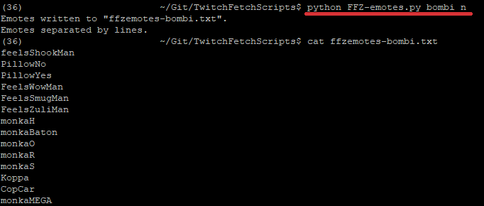
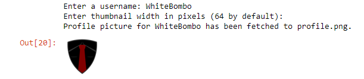
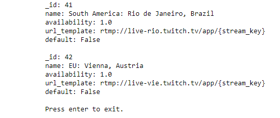

# TwitchFetchScripts
### [Download .zip](https://github.com/WhiteBombo/TwitchFetchScripts/archive/master.zip)

### [Get Python 3](https://www.python.org/downloads/)

### [Get Pillow](http://pillow.readthedocs.io/en/3.0.x/installation.html)

### [Get requests-library](http://docs.python-requests.org/en/master/user/install/#install)

Python scripts aimed to be used by streamers and channel administrators to interact with several API's to fetch useful information.

## Requirements
Tested with Python 3.6.1. Needs [Python version 3](https://www.python.org/) or further.
twitchLogo.py needs [Pillow](https://python-pillow.org).
FFZ-emotes.py requires requests-library available at [docs.python-requests.org](http://docs.python-requests.org/en/master/).

## FFZ-emote fetcher by Twitch channel - FFZ-emotes.py

#### V. 1.0
Fetches FFZ-emotes of a Twitch channel and writes them in the same directory in channel-specific files. Use by entering the channel name as an argument. User can have the script separate the emotes by spaces or by lines. The argument `n` after the channel name will separate the emotes with new lines. Leaving the second argument empty will separate them by spaces.
Requires python version 3.6 or higher due to the use of f-strings. Also requires the requests-library available at [docs.python-requests.org](http://docs.python-requests.org/en/master/). Simply install with pip: `pip install requests`.

## Twitch profile logo fetcher - twitchLogo.py

#### V. 1.1
Added a thumbnail maker thing. Now uses [Pillow](https://python-pillow.org). Install instructions [here](http://pillow.readthedocs.io/en/3.0.x/installation.html).

#### V. 1.0
Fetches a Twitch user's logo from the [Kraken API](https://dev.twitch.tv/docs/) and saves it in the same directory with the script.

#### How to use
Run and follow instructions.

## Twitch ingest server list - twitchIngests.py

#### V. 1.1
Cleaned up the script of excess stuff and published Client-ID in 'cred.py' file.
#### V. 1.0
Currently only shows all the information of Twitch's ingest servers provided by the [Kraken API](https://dev.twitch.tv/docs/).

#### How to use
Just run.
